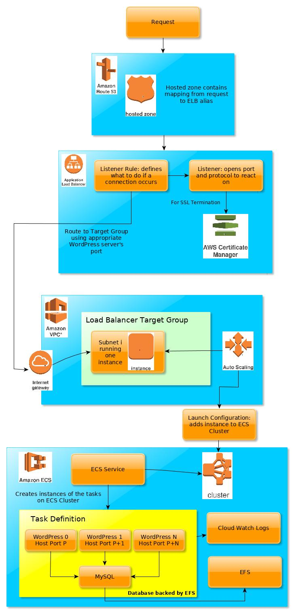

# wordpress-cloud-formation

Cloud formation project for deploying WordPress on AWS.

> **THIS PROJECT IS UNDER DEVELOPMENT**

# Table of Contents

1. [Overview](#overview)
1. [Set Up](#set-up)
    1. [Install Go](#install-go)
    1. [Install Govendor](#install-govendor)
1. [Pull The Code and Install Dependencies](#pull-the-code-and-install-dependencies)
1. [Building](#building)
1. [Running](#running)
    1. [Create the Domain Name and SSL Certificate](#create-the-domain-name-and-ssl-certificate)
        1. [Request a Domain Name](#request-a-domain-name)
        1. [Print the Hosted Zone](#print-the-hosted-zone)
        1. [Setup the SSL Certificate](#setup-the-ssl-certificate)
    1. [Create the Service Stack](#create-the-service-stack)
        1. [Create the CloudFormation Stack](#create-the-cloudformation-stack)
        1. [Print the Elastic Load Balancer Public Domain Name](#print-the-elastic-load-balancer-public-domain-name)
        1. [Alias the Elastic Load Balancer](#alias-the-elastic-load-balancer)
1. [Contributing](#contributing)
    1. [Gotchas](#gotchas)
1. [References](#references)

# Overview

The tool is used to:
1. Create a hosted zone with a domain name
1. Create an SSL certificate for the domain name
1. Deploy a set of wordpress servers on top of AWS infrastructure

Multiple stages are required because CloudFormation does not permit the SSL certificate to be verified using DNS
verification - only email verification. This creates a dependency loop because the email is sent to
`admin@${DOMAIN_NAME}.com`. The instance will not be created until the SSL certificate is validated and the SSL
cert can only be validated with an instance (running an email server).

Thus the decision was made to have a set of instructions to generate the SSL certificate, which would then be supplied
to the CloudFormation template. Setting up the SSL certificate uses DNS verification in the hosted zone in Route 53.

The architecture of the service is as follows (some minor details are left out):

<p align="center">
  
</p>

# Set Up

## Install Go

Install Go by following the instructions at https://golang.org/doc/install. If you are running Linux, you can install
it using your package manager. Remember to update your `PATH` to include the go commands:
```
PATH="~/go/bin:$PATH"
```

## Install Govendor

Go does not by default come with a package dependency system. However, there is a tool called `govendor`, which does
this. This tool was chosen over `godep` because it permits multiple versions of a given library to be installed.
Read more about the tool at https://github.com/kardianos/govendor.
```
go get -u github.com/kardianos/govendor
```

## Pull The Code and Install Dependencies

This will pull the code and the dependencies, putting the dependencies in `${PROJECT_ROOT}/vendor/`
```
govendor get github.com/ErrorsAndGlitches/wordpress-cloud-formation
```
The dependencies are defined in `./vendor/vendor.json`.

# Building

This will produce the executable with the same name as the package (`wordpress-cloud-formation`):
```
govendor build
```

# Running

Some notes before beginning:
* the default region used by the application is **us-west-2**. This is because it is the default region in the AWS SDK.
  And I live on the west coast.
* you can supply a global `-p aws_profile` flag if you have set up a specific AWS profile to create the infrastructure
  for. Otherwise the `default` profile found in `~/.aws/config` is used.
* different stages can be created, which is helpful if you want to have a testing and production stack. This is
  controlled using the `-s` flag e.g. `-s Gamma`, which you will see throughout the `README`.

## Create the Domain Name and SSL Certificate

### Request a Domain Name

Details:
* This **MUST** use the **us-east-1** region. It is like S3 where the service is global and thus centered in the US
  Standard region, which is **us-east-1**.
* Note that for many domanis, the information supplied to the SSL certficate is public. Some domains keep the
  information hidden such as **.org**. See [Route 53 Domains][] for more information.
* Defaults to the **US** country code. If this needs to be used outside the US, please create an issue to add the
  support.
* Note the period in the phone number argument - it is required.
* The zip code requites the 4 digit extension.
* Registering a domain name will automatically create a Route 53 Hosted Zone.

This script uses the default contact type. Use the `--help` function to learn more about the CLI parameters.
```
./wordpress-cloud-formation -r us-east-1 -s Gamma \
  register-domain-name \
  -d wordpress-domain.com \
  -f first_name -l last_name -e your.email@gmail.com \
  -o organization_name -t "street address" -y City -x State -z "00000-0000" -n +1.1234567890
```
This will print the operation id.

> You will recieve an email, which will require you to verify your email address. Failure to do so will cause the domain
> to be susended in about 2 weeks.

It can take a few minutes for the domain name registration to succeed. You can print the status via:
```
./wordpress-cloud-formation -r us-east-1 -s Gamma print-record-status -i 'operation-id'
```

[Route 53 Domains]: https://docs.aws.amazon.com/Route53/latest/DeveloperGuide/registrar-tld-list.html

### Print the Hosted Zone

The Hosted Zone ID, which was created when the domain name was registered, is required as a parameter for setting up the
SSL certificate.
```
./wordpress-cloud-formation -s Gamma -r us-east-1 describe-hosted-zone -d wordpress-domain.com
```

### Setup the SSL Certificate

Use the Hosted Zone ID from the previous step to setup SSL. The default region can be used here.
```
./wordpress-cloud-formation -s Gamma setup-ssl -d wordpress-domain.com -z "/hostedzone/00000000000000"
```

It can take up to 30 minutes for the certificate to be validated. You can run this command to see its current status:
```
./wordpress-cloud-formation describe-ssl --ssl-arn "arn:aws:acm:us-west-2:000000000000:certificate/00000000-0000-0000-0000-000000000000"
```

## Create the Service Stack

### Create the CloudFormation Stack

This command will create the CloudFormation stack. It may take some time for all of the resources in the stack to be
procured.
```
./wordpress-cloud-formation -s Gamma cf-service create \
  -d wordpress-domain.com \
  -b db_password \
  -a "arn:aws:acm:us-west-2:000000000000:certificate/00000000-0000-0000-0000-000000000000" \
  -w "wordpress_one_name:wordpress_two_name:wordpress_three_name"
```

## Print the Elastic Load Balancer Public Domain Name

The output of the template is the load balancer's public domain name. After the stack has been created, it can be
printed with:
```
./wordpress-cloud-formation -s Gamma cf-service describe
```

### Alias the Elastic Load Balancer

The final step is to forward requests sent to the domain name to the Elastic Load Balancer. This is done by creating an
**Alias** Record Set entry in the Hosted Zone. To do this, use the ELB's public domain name retrieved in the previous
step. Additionally, you will need to look up the hosted zone for the ELB based on the region that you created the ELB.
Note that the ELB created in the stack is an application ELB. The information can be found on the [ELB Region][] page.
```
./wordpress-cloud-formation -s Gamma create-elb-alias \
  -d wordpress-domain.com \
  -z Z0000000000000 \
  -e LoadBalancerGamma-0000000000.us-west-2.elb.amazonaws.com \
  -n Z111111111111
```
The Record Set should update instantaneously.

[ELB Region]: https://docs.aws.amazon.com/general/latest/gr/rande.html#elb_region

# Contributing

Contributing to a Go projects takes a few extra steps compared to other languages. This is because the import statements
reference the actual github repository. Golang imports based on the file path from the `GOPATH` location. Thus we can
create a directory like the source repository, but then clone the fork in the directory:
```
USER_NAME=${GITHUB_USER_NAME}
PROJ_DIR="${GOPATH}/src/github.com/ErrorsAndGlitches/"

mkdir -p "${PROJ_DIR}"
cd "${PROJ_DIR}"
# fetch the code
git clone git@github.com:${USER_NAME}/wordpress-cloud-formation.git
# pull the dependencies into ./vendor/
govendor sync
```

Debug logging can be turned on by setting an environment variable:
```
export DEBUG=1
```

## Gotchas

* Note that the **Registrant Contact** in Route 53 Domains is also known as the **Bill Contact**.

# References

* The base of this project was copied from the [Colectiva Legal sms-alert-system-cloud-formation](https://github.com/ColectivaLegal/sms-alert-system-cloud-formation) project
* [A reference architecture for deploying containerized microservices with Amazon ECS and AWS CloudFormation](https://github.com/awslabs/ecs-refarch-cloudformation)
